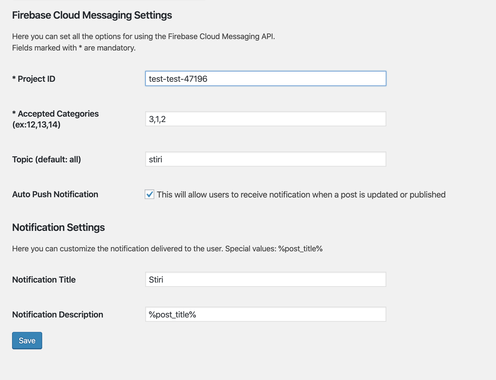

# FCM - Integration (Wordpress plugin)
Firebase Cloud Messaging Integration allow your website to send push notifications to your users when a post is published, or when you need.

### How to use
Firebase Cloud Messaging Integration uses Firebase HTTP v1 API (latest) and requires GOOGLE_APPLICATION_CREDENTIALS to work with your Firebase account. Is mandatory to provide in the root project client_credentials.json and add your project Firebase credentials in the plugin settings page
[https://firebase.google.com/docs/reference/fcm/rest/v1/projects.messages](https://firebase.google.com/docs/reference/fcm/rest/v1/projects.messages)

### Requirements
- google api credentials file in root project with name client_credentials.json
- complete mandatory fields in FCM Integration Settings Page in the Admin Wordpress Backend (plugin normal admin page)

How to get google api credentials file
[https://cloud.google.com/docs/authentication/getting-started](https://cloud.google.com/docs/authentication/getting-started)

### Features
- auto push (send notifications automatically when posting new article)
- accepted categories (only specified categories will be allowed to push notifications)
- customize notifications (custom topic, title and body for notifications)

### Instalation
- add project in `wp-content/plugins/FCM-integration` in your wordpress site
- run `composer install` in root project. This will install google api client
- add client_credentials.json in root project


### Default payload
```json
{
  "message": {
    "topic": "all",
    "notification": {
      "title": "New article",
      "body": "Read all about it! "
    },
    "data": {
      "postID": "15"
    }
  }
}
```

### Git Hub
[https://github.com/irimiaionut/wordpress-plugin-firebase-cloud-messaging-integration](https://github.com/irimiaionut/wordpress-plugin-firebase-cloud-messaging-integration)

# Previews

### Preview Posts Page


### Preview Settings Page
